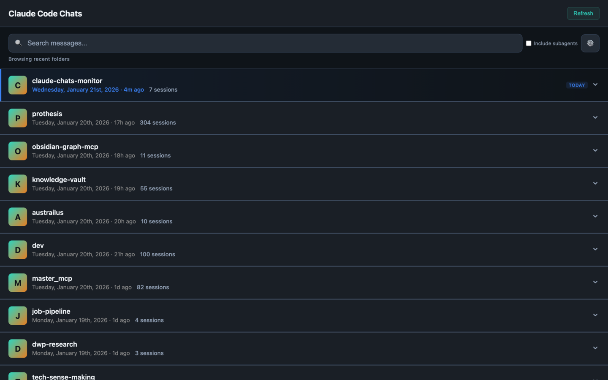

# Claude Code Chat Explorer

[](https://opensource.org/licenses/MIT)

Browse, search, and explore your Claude Code conversation history. A fast, self-hosted web interface powered by SQLite with full-text search.



> [!WARNING]
> **Claude Code deletes conversations older than 30 days by default.** Before using this tool, [increase your retention period](#conversation-history-retention-important) or you may have already lost history.

## Why This Exists

Claude Code stores all your conversations locally in `~/.claude/projects/` as JSONL files, but there's no built-in way to browse or search them. This tool gives you:

- **Full-text search** across all your conversations
- **Project organization** - see conversations grouped by project
- **Real-time updates** - new messages appear instantly via WebSocket
- **Token tracking** - monitor your usage patterns
- **Mobile-friendly** - works on desktop and mobile browsers

## Quick Start

```bash
# Clone the repository
git clone https://github.com/drewburchfield/claude-code-chat-explorer.git
cd claude-code-chat-explorer

# Start the container
./quick-start.sh
```

Open **http://localhost:9876** in your browser.

## Features

### Browse & Search
- **Project view** - Conversations organized by project directory
- **Full-text search** - Fast FTS5-powered search with highlighted snippets
- **Session details** - See token counts, models used, and activity timelines

### Conversation Viewer
- **Full message history** - User and assistant messages with timestamps
- **Tool calls** - Expandable view of tool usage with parameters and results
- **In-conversation search** - Find specific content within long conversations
- **Export** - Download conversations as JSON

### Real-time Monitoring
- **Live updates** - New conversations and messages appear instantly
- **Activity indicators** - See which sessions are active
- **Subagent tracking** - View spawned Task tool agents grouped under parents

## Requirements

- Docker and Docker Compose
- Claude Code installed (with conversations in `~/.claude`)

## How It Works

1. **Scans** your `~/.claude/projects/` directory for conversation files
2. **Indexes** conversations into a SQLite database with full-text search
3. **Watches** for changes and updates the index incrementally
4. **Serves** a web interface on port 9876

The database and all processing happens locally. Your conversations never leave your machine.

## Architecture

```
claude-code-chat-explorer/
├── Dockerfile              # Multi-stage Alpine build
├── docker-compose.yml      # Container configuration
├── quick-start.sh          # Startup script
├── package.json            # Dependencies
├── src/
│   ├── chats-mobile.js     # Express server
│   ├── analytics/
│   │   ├── core/           # Conversation parsing
│   │   └── data/           # SQLite + FTS5 layer
│   └── analytics-web/
│       └── chats_mobile.html  # Web UI
└── test/                   # Vitest test suite
```

## Configuration

### Conversation History Retention (Important!)

Claude Code **deletes conversations older than 30 days by default**. If you want to preserve your history for this tool to browse, you need to increase the retention period.

Edit `~/.claude/settings.json` and add or modify the `cleanupPeriodDays` setting:

```json
{
  "cleanupPeriodDays": 99999
}
```

| Value | Behavior |
|-------|----------|
| `99999` | Effectively infinite (recommended) |
| `365` | Keep conversations for 1 year |
| `30` | Default - deletes sessions inactive for 30+ days |

**Note:** Cleanup happens when you start a new Claude Code session, not continuously. If you've already lost history, it cannot be recovered.

If the file doesn't exist, create it:
```bash
echo '{"cleanupPeriodDays": 99999}' > ~/.claude/settings.json
```

### Environment Variables

| Variable | Default | Description |
|----------|---------|-------------|
| `CLAUDE_HOME` | `~/.claude` | Claude Code data directory |
| `CLAUDE_DB_PATH` | `/data/conversations.db` | Database location |

### Change Port

Edit `docker-compose.yml`:
```yaml
ports:
  - "9877:9876"  # Use port 9877 instead
```

## Management

```bash
# View logs
docker compose logs -f

# Stop
docker compose down

# Restart
docker compose restart

# Rebuild after updates
docker compose up -d --build

# Reset database (re-indexes everything)
docker compose down -v
docker compose up -d --build
```

## Security

The container runs hardened:
- Non-root user
- Read-only filesystem
- Dropped capabilities
- Memory limits (1GB)
- Localhost-only port binding

Your Claude data is mounted read-only.

## Troubleshooting

### No conversations showing?
Check that Claude Code has conversations:
```bash
find ~/.claude/projects -name "*.jsonl" | head -5
```

### Container won't start?
Check logs:
```bash
docker compose logs --tail=50
```

### Port conflict?
Change the port in `docker-compose.yml` and restart.

## Development

```bash
npm install
npm test              # Run tests
npm run test:coverage # With coverage
npm run test:watch    # Watch mode
```

## License

MIT
