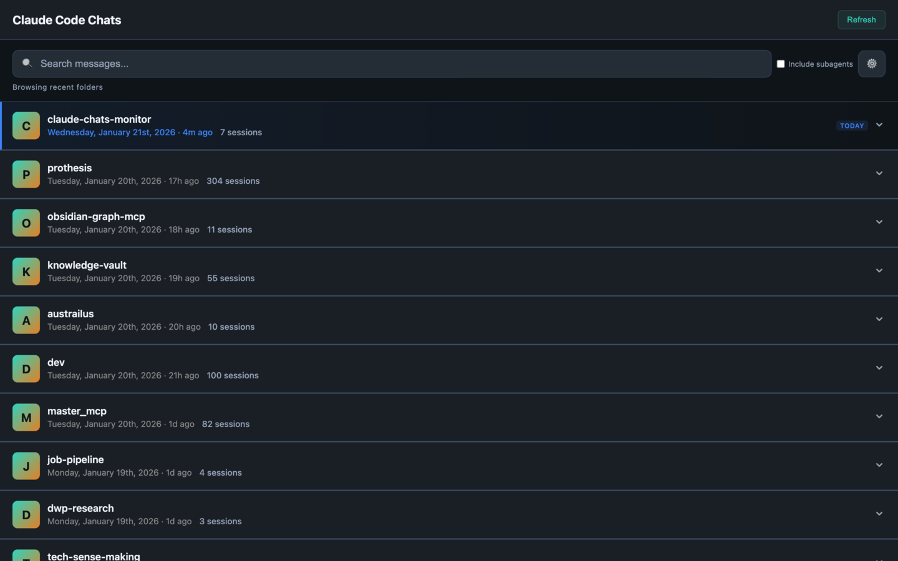

# Claude Code Chat Explorer

[](https://deepwiki.com/drewburchfield/claude-code-chat-explorer)

[](https://opensource.org/licenses/MIT)

Browse, search, and explore your Claude Code conversation history. A fast, self-hosted web interface powered by SQLite with full-text search.



> [!NOTE]
> Claude Code can be configured to clean up old transcripts via the `cleanupPeriodDays` setting. If you want this tool to browse your full history, [confirm your retention setting](#conversation-history-retention) first.

## Why This Exists

Claude Code stores all your conversations locally in `~/.claude/projects/` as JSONL files, but there's no built-in way to browse or search them. This tool gives you:

- **Full-text search** across all your conversations
- **Project organization** - see conversations grouped by project
- **Real-time updates** - new messages appear instantly via WebSocket
- **Token tracking** - monitor your usage patterns
- **Mobile-friendly** - works on desktop and mobile browsers

## Quick Start

```bash
# Clone the repository
git clone https://github.com/drewburchfield/claude-code-chat-explorer.git
cd claude-code-chat-explorer

# Start the container
./quick-start.sh
```

The startup output prints a one-time authenticated URL. Open that link in your
browser; it sets an HttpOnly session cookie and immediately removes the token
from the address bar.

The web server is published on `127.0.0.1:9876` only through a small proxy that
has no transcript or database mounts. The transcript-reading app stays on an
internal-only Docker network, so it cannot make outbound Internet connections.

## Features

### Browse & Search
- **Project view** - Conversations organized by project directory
- **Full-text search** - FTS5-powered search with highlighted snippets, indexing message text, thinking blocks, tool inputs/results, and system content (matches what's on disk)
- **Query operators** - `AND` / `OR` / `NOT`, `"exact phrase"`, and `prefix*`
- **Filters** - Narrow by project, model, date range, and subagents; facet values come from `GET /api/facets`
- **Role/tool filtering** - Restrict matches to a message role (user / assistant / system / tool) or a specific tool
- **Session details** - See token counts, models used, and activity timelines

### Conversation Viewer
- **Full message history** - User and assistant messages with timestamps
- **Tool calls** - Expandable view of tool usage with parameters and results
- **In-conversation search** - Find specific content within long conversations
- **Export** - Download conversations as JSON

### Real-time Monitoring
- **Live updates** - New conversations and messages appear instantly
- **Activity indicators** - See which sessions are active
- **Subagent tracking** - View spawned Task tool agents grouped under parents

## MCP Server

An MCP server exposes the same search to MCP clients (e.g. Claude Code), so an agent can query your past conversations directly. It reads the same SQLite index read-only and serves search through the same code path as the web UI.

Tools: `search_conversations` (FTS operators + project/model/role/tool filters; returns ranked hits with snippets and a resource link per hit), `search_within_conversation`, and `list_facets`. Conversations are exposed as resources at `claude-chat://conversation/{id}`.

Run it with `npm run mcp` (or the `claude-chats-mcp` bin). Add to Claude Code via `.mcp.json` (see `.mcp.json.example`):

```json
{
  "mcpServers": {
    "claude-chats-search": {
      "command": "node",
      "args": ["/absolute/path/to/claude-code-chat-explorer/src/mcp/server.js"],
      "env": { "CLAUDE_DB_PATH": "/absolute/path/to/conversations.db" }
    }
  }
}
```

The server needs read access to the conversation JSONL files at their indexed paths (run it on the host, or mount `~/.claude` if containerized). See `docs/MCP.md` for details.

## Requirements

- Docker and Docker Compose (the container bundles a supported Node runtime)
- Claude Code installed (with conversations in `~/.claude`)
- For local (non-Docker) development: Node 20–25 (`better-sqlite3` does not support Node 18 or 26+)

## How It Works

1. **Scans** your `~/.claude/projects/` directory for conversation files
2. **Indexes** conversations into a SQLite database with full-text search
3. **Watches** for changes and updates the index incrementally
4. **Serves** a web interface on port 9876

The database and all processing happens locally. The default container network
blocks runtime outbound access, and HTTP/WebSocket access requires the random
token printed at startup.

## Architecture

```
claude-code-chat-explorer/
├── Dockerfile              # Multi-stage Alpine build
├── docker-compose.yml      # Container configuration
├── quick-start.sh          # Startup script
├── package.json            # Dependencies
├── src/
│   ├── chats-mobile.js     # Express server
│   ├── analytics/
│   │   ├── core/           # Conversation parsing
│   │   └── data/           # SQLite + FTS5 layer
│   └── analytics-web/
│       └── chats_mobile.html  # Web UI
└── test/                   # Vitest test suite
```

## Configuration

### Conversation History Retention

Claude Code exposes a `cleanupPeriodDays` setting that bounds how long inactive transcripts stay on disk. The default has varied across versions; check your current behavior and set an explicit value if you want this tool to browse a long history.

Edit `~/.claude/settings.json` and add or modify the `cleanupPeriodDays` setting:

```json
{
  "cleanupPeriodDays": 99999
}
```

| Value | Behavior |
|-------|----------|
| `99999` | Effectively infinite (recommended) |
| `365` | Keep conversations for 1 year |
| `30` | Cleans up sessions inactive for 30+ days |

**Note:** When cleanup runs, it triggers at Claude Code session start - not continuously. Anything already cleaned up cannot be recovered.

If the file doesn't exist, create it:
```bash
echo '{"cleanupPeriodDays": 99999}' > ~/.claude/settings.json
```

### Environment Variables

| Variable | Default | Description |
|----------|---------|-------------|
| `CLAUDE_HOME` | `~/.claude` | Claude Code data directory |
| `CLAUDE_DB_PATH` | `/data/conversations.db` | Database location |

### Change Port

Edit `docker-compose.yml`:
```yaml
ports:
  - "9877:9876"  # Use port 9877 instead
```

## Management

```bash
# View logs
docker compose logs -f

# Stop
docker compose down

# Restart
docker compose restart

# Rebuild after updates
docker compose up -d --build

# Reset database (re-indexes everything)
docker compose down -v
docker compose up -d --build
```

## Upgrading

When the index format changes between versions, the app does a one-time full re-index on next start. It runs in the **background** — the server starts serving immediately and existing results stay searchable while the new index builds (large histories can take several minutes). Indexing now stores per-message content for role/tool-granular search, so the on-disk index is larger than in earlier versions; plan for a few GB on large histories.

## Security

The container runs hardened:
- Non-root user
- Read-only filesystem
- Dropped capabilities
- Memory limits (1GB)
- Localhost-only port binding
- Random-token authentication for HTTP and WebSocket access
- Exact-origin checks for WebSocket upgrades
- Internal Docker network with no runtime outbound access

Your Claude data is mounted read-only. Native development runs also bind to
`127.0.0.1` by default and require a random token unless authentication is
explicitly disabled by a test harness.

## Troubleshooting

### No conversations showing?
Check that Claude Code has conversations:
```bash
find ~/.claude/projects -name "*.jsonl" | head -5
```

### Container won't start?
Check logs:
```bash
docker compose logs --tail=50
```

### Port conflict?
Change the port in `docker-compose.yml` and restart.

## Development

```bash
npm install
npm test              # Run tests
npm run test:coverage # With coverage
npm run test:watch    # Watch mode
```

## License

MIT
